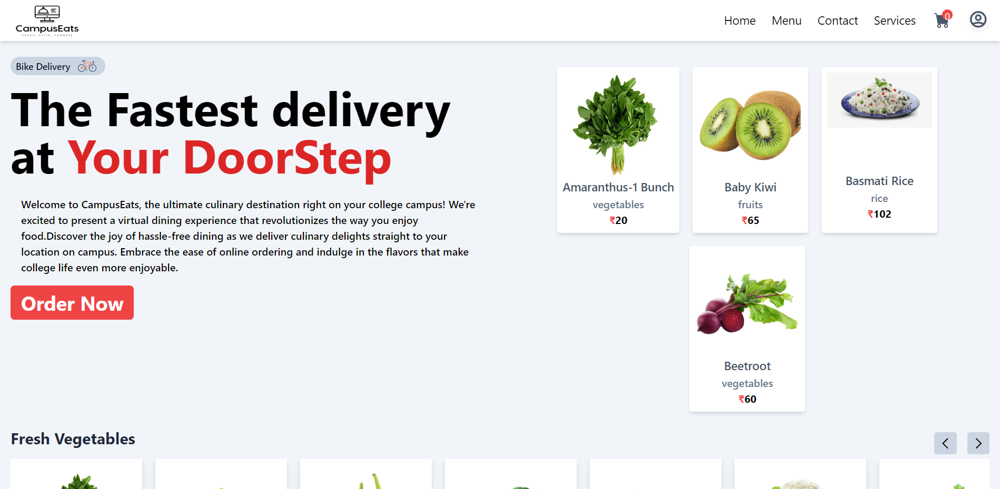

# CampusEats
> Major Project

# Build a Complete FullStack Food Delivery Responsive Mern-App [React-Redux-Node.js-MongoDB-Express-TailwindCSS
  Build a Complete FullStack Food Delivery Responsive Mern-App [React-Redux-Node.js-MongoDB-Express-TailwindCSS

  
 

  # Backend Environment Variables : 

  MONGODB_URL : "",
  STRIPE_SECRET_KEY : "",
  FRONTEND_URL : "",

  My Backend URL : https://backend-mern-bhzs.onrender.com

  # To Start the Backend : 

  ``` 
  npm run dev
  ```

  # Frontend Variables : 
  
  REACT_APP_SERVER_DOMAIN = <backend url>
  REACT_APP_ADMIN_PANEL = <admin email id>
  REACT_APP_STRIPE_PUBLIC_KEY = <stripe public key>

  # To Start the Frontend : 
  ```
  npm start
  ```

  > # Packages Used


[React](https://reactjs.org/) | React is a free and open-source front-end JavaScript library for building user
interfaces based on JI components. |

| Tailwind CSS
[TailwindCSS](https://tailwindcss.com/) | Tailwind CSS is a framework like no other. Rather than constraining you to a set design, it gives you the tools and the standardization to build exactly what you want. |


❘ Express
| [Express](https://expressjs.com/) | Express.js, or simply Express, is a back end web application framework for Node.js, released as free and open-source software under the MIT License. It is designed for building web applications and APIs. |

| React Router Dom
[ReactRouterDom](https://react router.com/en/main) | React Router DOM is an npm package that enables you to implement
dynamic routing in a web app. It allows you to display pages and allow users to navigate them. |

| Framer Motion
| [FramerMotion](https://www.framer.com/motion/) | A production-ready motion library for React. Utilize the power behind
Framer, the best prototyping tool for teams. Proudly open source. |

| React Icons
[ReactIcons](https://react-icons.github.io/react-icons/) | All Popular Icons in single package. |


 > [Follow Us](https://www.instagram.com/itz_prabh.saini/)
